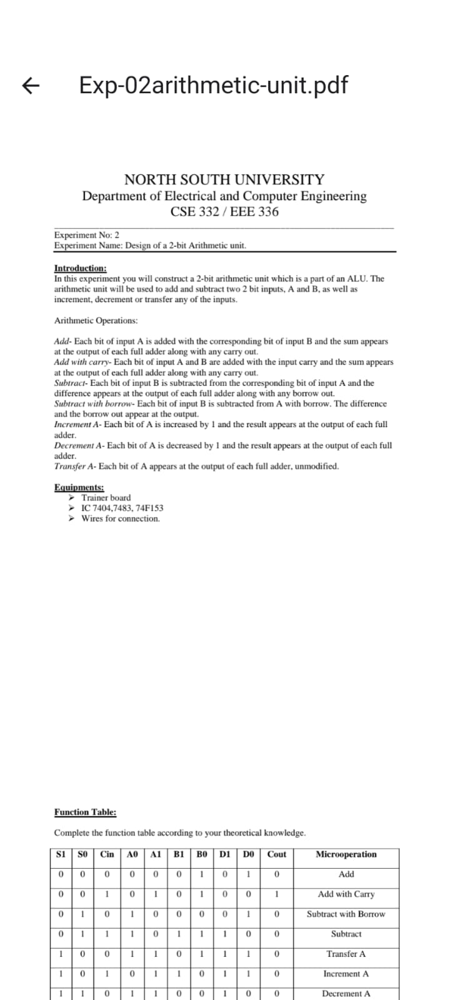
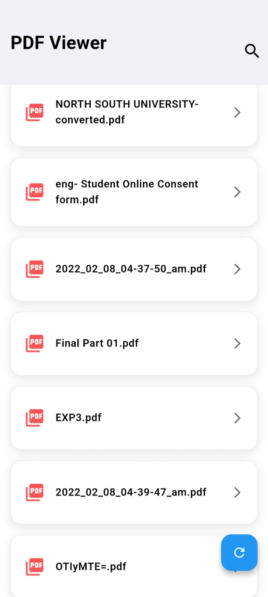
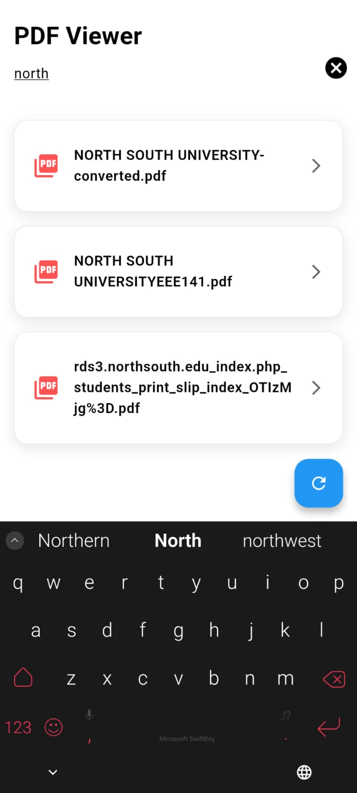

# PDF Viewer Flutter App

This Flutter application allows users to view PDF files stored on their device. It has the functionality to search and display all PDF files from the external storage, allowing for easy viewing and navigation.

## Features

- **Search Functionality**: Quickly search for PDF files by name.
- **PDF Preview**: Tap on a PDF file to open it in a dedicated PDF viewer screen.
- **Directory Access**: It grants permission to access the device's external storage and fetches all PDF files.
- **Refresh Button**: Refresh the list of available PDFs by tapping the refresh button.

## Screenshots

### Main Screen, PDF Viewer Screen, and PDF Search Screen

<div style="display: flex; justify-content: space-between; align-items: center;">
  
  
  
</div>

## Installation

To get started with this project, follow these steps:

### Dependencies
permission_handler - For handling storage permissions.
external_path - To access external storage directories.
path - For file path manipulation.

### 1. Clone the repository
```bash
git clone https://github.com/your-username/your-repository-name.git
cd your-repository-name

